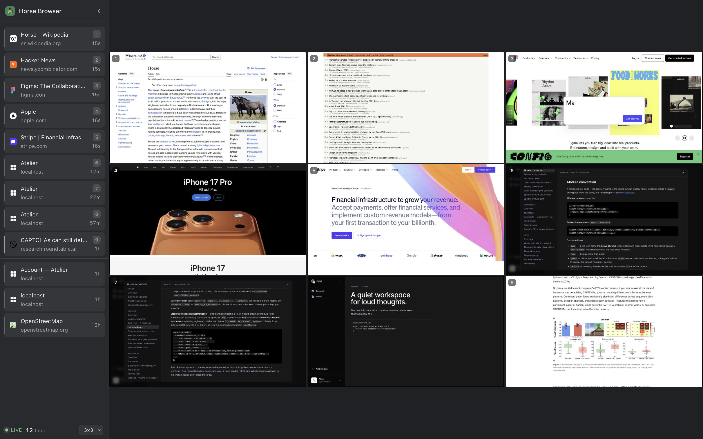

<p align="center">
  
</p>
<!-- static fallback if the animated SVG ever fails to render:
<p align="center">
  
</p>
-->

# Horse Browser 🐴

**A browser where your agents live.** Log in once; every agent you point at it inherits the session — and you watch them all on one live wall.

<p align="center">
  <a href="https://github.com/pA1nD/horse-browser/releases"></a>
  <a href="LICENSE"></a>
  
</p>

Every other tool hands each agent a *throwaway* browser. But you don't want throwaway — you want **your** browser, logged into your stuff, that agents quietly borrow. The catch: on macOS, every CDP command yanks the browser to the foreground ([a known open sore](https://github.com/ChromeDevTools/chrome-devtools-mcp/issues/1254) across [the big tools](https://github.com/vercel-labs/agent-browser/issues/1247)). Horse Browser fixes that — agents open tabs **in the background**, each in their own **colored group**, in a **dedicated browser** that coexists with your daily one and never steals your focus.

> Why "horse"? *Browse* meant a horse grazing — nibbling shoots — long before it meant clicking links. A horse that browses is the *original* browser. And it rides in [browser-harness](https://github.com/browser-use/browser-harness): you harness a horse. 🐴

## Setup

You don't install this by hand. Hand the repo to your agent and let it do the work — paste into **Claude Code** or **Codex**:

```text
Set up https://github.com/pA1nD/horse-browser for me.

Read SKILL.md and run ./install.sh, then register the skill so you use bh_open
to open tabs from now on.
```

That's it. `install.sh` fetches a dedicated **Chrome for Testing** (lives alongside your daily browser, never fights it for the dock), puts the `horse-browser` launcher on your PATH, and opens the browser so you can **sign into your apps once** — those logins persist for every agent.

Prefer your own Chromium? `export HORSE_BROWSER_BIN=/path/to/chromium` before setup.

## How it stays out of your way

Sign into Gmail, GitHub, your dashboards, whatever — **once** — and every agent you point at `:9223` inherits those sessions. No re-auth dance, no cookie juggling, no "paste your token" on every run. The catch with one shared browser is everyone trips over everyone, so three things keep it civil:

- **Coexists with your daily browser.** A *separate* browser (Chrome for Testing) — launching it never hijacks your everyday Chrome/Brave, and clicking yours never lands you in the agents' window.
- **Focus-safe by construction.** Tabs open in the background and activate through the extension instead of `Target.activateTarget` (which calls `[NSApp activate]` and yanks the browser over whatever you're doing). The page is told it's foregrounded via focus emulation, so nothing misbehaves.
- **Per-session tab groups.** Each agent's tabs live in their own colored group; you see whose-is-whose at a glance, humans and agents in one window.

(Browserbase, Steel, Hyperbrowser & co. solve scale by giving each agent its *own throwaway* browser. Great for the cloud; useless when you want **one real browser, on your machine, that stays logged in**. That's this.)

## Watch them all — the Agent Monitor

<p align="center">
  
</p>

Click the 🐴 toolbar button for a live **2×2 / 3×3 wall** of screencasts — one tab per cell — so you can watch every agent browse at once on a big screen.

Built around **stable slots**: a tab keeps its cell, so the picture never shuffles under you. Activity lights up *in place* (a green pulse on the tab an agent just acted on) instead of reordering everything; the wall only changes membership when a tab has gone idle and a busier one is waiting. A theme-aware sidebar lists every tab — slot-numbered, recency-ranked, with a cutoff line marking what's on the wall vs. waiting. Click any pane to jump to that tab. Pure read-only over CDP (a *second* client alongside whatever's driving), so it costs the agents nothing.

## How agents drive it

`horse-browser` runs a dedicated browser with CDP on `:9223`. Anything that speaks CDP can drive it — [browser-harness](https://github.com/browser-use/browser-harness) is the natural fit:

```bash
horse-browser                            # idempotent: launches if down, no-op if up
export BU_CDP_URL=http://127.0.0.1:9223  # point your CDP client at it
```

Agents open tabs with `bh_open(url)` (their own colored group, no focus steal) rather than bare `goto_url` (which clobbers whoever's focused). The discipline lives in [SKILL.md](SKILL.md) — register it once and agents follow it automatically.

## What's inside

- **`extension/`** — MV3 extension: the tab grouper + the Agent Monitor.
- **`bin/horse-browser`** — idempotent launcher; ensures the browser is up on `:9223`.
- **`install.sh`** — one-time setup; fetches the browser, registers the launcher + statusline.
- **`statusline.sh`** — Claude Code statusline; shows `ses:XXXX` = your tab-group label.
- **`SKILL.md`** — the agent's playbook (the `bh_open` discipline + a helper recipe it self-installs).

A thin, self-contained setup — browser-harness (or anything else speaking CDP) is just a *consumer* on port 9223.

## License

MIT © pa1nd
